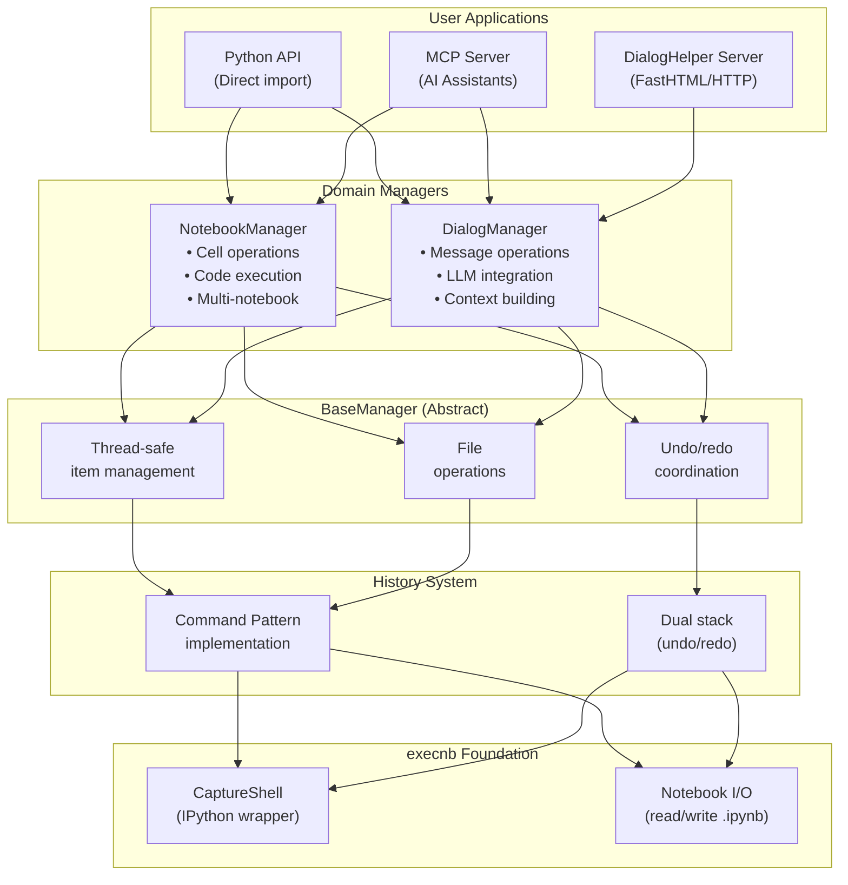
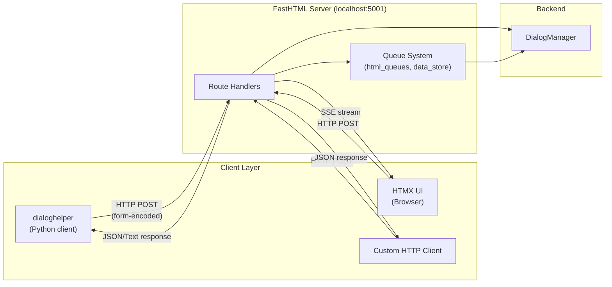
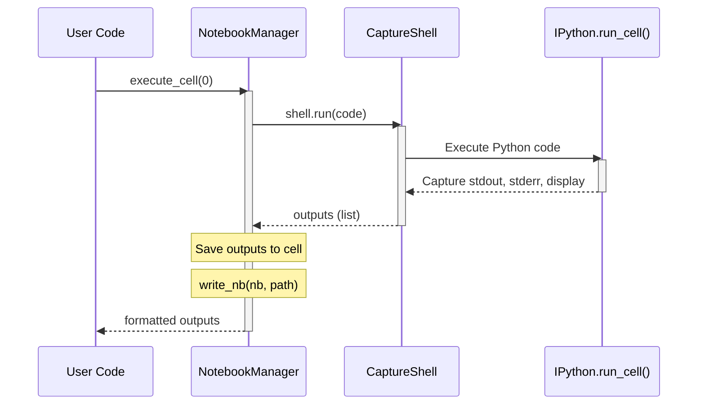
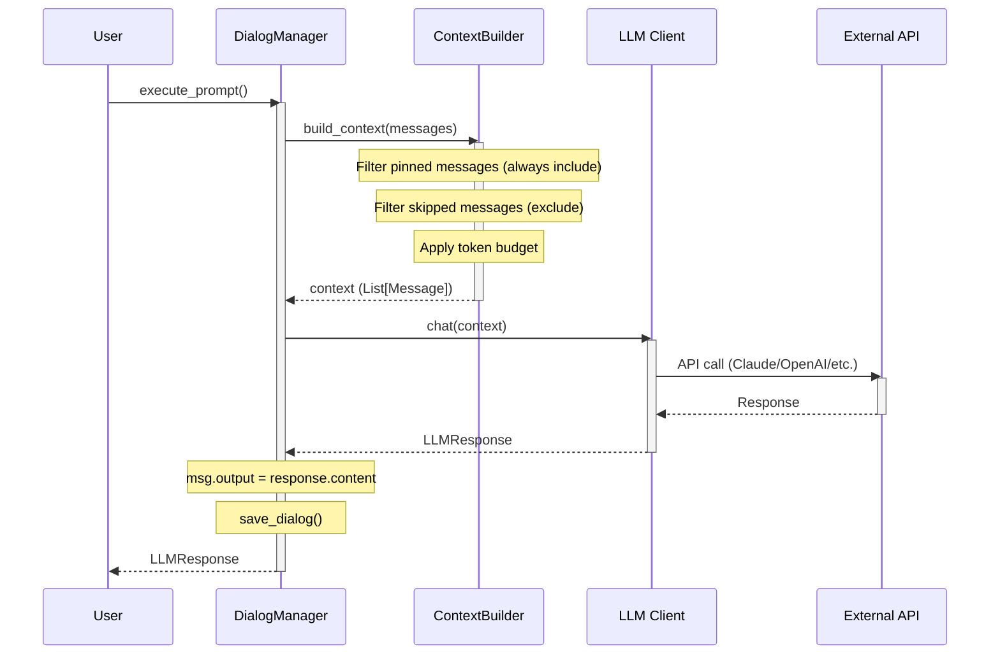

# HeadlesNB Architecture Guide

This document explains the architecture of HeadlesNB, covering **what** each component does, **how** it works, and **why** it was designed that way. This information is essential for new developers to understand the project and make informed decisions about improvements or refactoring.

## Table of Contents

- [Design Philosophy](#design-philosophy)
- [High-Level Architecture](#high-level-architecture)
- [Core Components](#core-components)
  - [execnb Foundation](#execnb-foundation)
  - [Base Classes](#base-classes)
  - [NotebookManager](#notebookmanager)
  - [DialogManager](#dialogmanager)
  - [History System](#history-system)
  - [DialogHelper Server](#dialoghelper-server)
- [Data Flow](#data-flow)
- [Design Decisions](#design-decisions)
- [Potential Improvements](#potential-improvements)

---

## Design Philosophy

HeadlesNB was built around these core principles:

### 1. No Jupyter Server Dependency

**Why**: Jupyter servers are heavy, require complex setup, and introduce network overhead for what are fundamentally local operations. By using IPython's `InteractiveShell` directly (via execnb), we get the same execution capabilities without the server complexity.

**Trade-off**: We lose Jupyter's built-in features like notebook UI, extensions, and multi-user support. This is acceptable because HeadlesNB targets programmatic and AI-assisted use cases, not human editing.

### 2. Notebooks as Persistence Format

**Why**: The `.ipynb` format is:
- Well-documented and widely understood
- Supports rich metadata in cell headers
- Can be opened in Jupyter for debugging
- Has existing tooling for diffing, versioning, etc.

**Trade-off**: JSON parsing overhead, larger files than binary formats. Acceptable because notebooks are typically small and the interoperability benefits outweigh performance costs.

### 3. Command Pattern for Undo/Redo

**Why**: Each operation (insert, delete, move) is encapsulated as a reversible command. This provides:
- Clean separation between "what to do" and "how to do it"
- Easy addition of new undoable operations
- Consistent undo behavior across all operations

**Trade-off**: Memory overhead for storing command history. Mitigated by configurable history size limit (default: 100 operations).

### 4. Separate Concerns: Notebooks vs Dialogs

**Why**: Notebooks and dialogs have different semantics:
- **Notebooks**: Cells with code/markdown, focus on execution
- **Dialogs**: Messages with types (code/note/prompt), focus on LLM conversation

Keeping them separate allows each to evolve independently while sharing common infrastructure (base classes, execution engine).

**Trade-off**: Some code duplication between NotebookManager and DialogManager. Acceptable because the shared base classes minimize this, and the semantic differences justify the separation.

---

## High-Level Architecture



---

## Core Components

### execnb Foundation

#### What It Does
Provides the execution engine for running Python code in notebooks:
- `CaptureShell`: Wraps IPython's `InteractiveShell` to capture outputs
- `nbio`: Functions for reading/writing `.ipynb` files

#### How It Works
```python
# CaptureShell manages an IPython shell
shell = CaptureShell(path=Path("."))

# Execute code and capture all outputs
outputs = shell.run("print('hello')")
# Returns: [{'output_type': 'stream', 'name': 'stdout', 'text': ['hello\n']}]

# Supports timeouts, kernel restart, execution stopping
shell.restart_kernel()  # Clear all state
```

#### Why This Way
- **IPython as engine**: IPython handles all Python execution edge cases (magics, display, errors). Reimplementing would be error-prone.
- **Output capture**: We need structured outputs (streams, results, errors) for programmatic use. IPython provides this via its displayhook system.
- **Path management**: Each shell has a working directory, enabling relative imports and file operations.

#### Potential Changes
- Could add async execution support for long-running operations
- Could pool shells for performance (currently one shell per notebook)

---

### Base Classes

**File**: `headlesnb/base.py`

#### What It Does
Provides abstract base classes for managers:
- `ManagedItemInfo`: Base dataclass for items (notebooks, dialogs)
- `BaseManager`: Abstract manager with common operations

#### How It Works
```python
@dataclass
class ManagedItemInfo(ABC):
    name: str                    # Unique identifier
    path: Optional[Path]         # File path (None for in-memory)
    shell: Optional[CaptureShell]  # Execution engine
    history: OperationHistory    # Undo/redo stack
    created_at: datetime
    last_activity: datetime
    is_active: bool

class BaseManager(ABC):
    def __init__(self, root_path):
        self._items = {}         # name -> item mapping
        self._active_item = None # Currently focused item
        self._lock = Lock()      # Thread safety
```

#### Why This Way
- **Dataclass for items**: Clean, typed structure with sensible defaults
- **Dict for storage**: O(1) lookup by name, simple iteration
- **Thread lock**: Multiple clients (MCP, HTTP) may access simultaneously
- **Abstract methods**: Force subclasses to implement type-specific logic

#### Design Decision: Why Not Use Notebook Directly?

We wrap notebooks in `ManagedItemInfo` rather than using them directly because:
1. Need to track metadata (path, shell, history) not in the notebook format
2. Need multiple notebooks with independent shells
3. Need to coordinate undo/redo with the notebook object

---

### NotebookManager

**File**: `headlesnb/nb_manager.py`

#### What It Does
High-level API for notebook operations:
- Create/load/save notebooks
- Insert/delete/modify cells
- Execute code
- Manage multiple notebooks simultaneously

#### How It Works

**Multi-notebook management**:
```python
manager = NotebookManager(root_path=".")

# Each notebook gets its own shell (kernel)
manager.use_notebook("nb1", "notebook1.ipynb", mode="create")
manager.use_notebook("nb2", "notebook2.ipynb", mode="create")

# One notebook is "active" - receives operations
manager.set_active_notebook("nb1")
manager.execute_code("x = 1")  # Runs in nb1's kernel
```

**Cell operations**:
```python
# insert_cell creates a Command object for undo support
def insert_cell(self, index, cell_type, source):
    command = InsertCellCommand(index, cell_type, source)
    command.execute(self)                    # Perform the operation
    self._active_item.history.add(command)   # Record for undo
```

#### Why This Way

- **Active notebook pattern**: Simplifies API - operations apply to current notebook without repeating name in every call
- **Independent kernels**: Variables in one notebook don't pollute another
- **Commands for all modifications**: Uniform undo/redo behavior

#### Key Trade-off: Cell Index vs Cell ID

We use **integer indices** for cell operations, not cell IDs:
- **Pros**: Simple, matches Jupyter's model, fast lookup
- **Cons**: Indices shift when cells are inserted/deleted

Alternative considered: Cell IDs (like Jupyter's)
- More stable references but adds complexity
- Decided against because notebook operations are typically sequential
- DialogManager uses IDs (see below) because dialogs need stable references

---

### DialogManager

**File**: `headlesnb/dialogmanager/manager.py`

#### What It Does
Manages AI dialog conversations:
- Message-based structure (code, note, prompt, raw)
- LLM integration for prompt execution
- Context building for LLM calls

#### How It Works

**Messages vs Cells**:
```python
# Message has rich metadata for AI interactions
@dataclass
class Message:
    id: str           # Stable identifier (unlike cell index)
    content: str
    msg_type: str     # 'code', 'note', 'prompt', 'raw'
    output: str       # Execution output or LLM response
    pinned: int       # Always include in LLM context
    skipped: int      # Exclude from LLM context
    # ... more metadata
```

**LLM Integration**:
```python
def execute_prompt(self, msg_id=None):
    # 1. Find the prompt message
    msg = self._find_prompt(msg_id)

    # 2. Build context from prior messages
    context = self._context_builder.build_context(
        dialog_messages=dialog.messages[:msg_index],
        current_prompt=msg.content
    )

    # 3. Call LLM
    response = self._llm_client.chat(context)

    # 4. Store response in message output
    msg.output = response.content
```

#### Why This Way

- **Message IDs**: Dialogs need stable references because:
  - LLM responses reference specific messages
  - Context building needs to track pinned/skipped state
  - External tools (dialoghelper) reference by ID

- **Pinned/Skipped flags**: LLM context windows are limited. These flags let users:
  - Pin: "Always include this" (important setup code, key context)
  - Skip: "Never include this" (old failed attempts, debugging)

- **Output in message**: Keeps prompt and response together, enables re-running prompts

#### Design Decision: Why Not Inherit from NotebookManager?

DialogManager does NOT inherit from NotebookManager because:
1. **Different semantics**: Cells ≠ Messages. Messages have types, outputs are treated differently
2. **Different operations**: Prompts execute via LLM, not kernel
3. **Different serialization**: Messages need special separator for prompt/response pairs

Both inherit from `BaseManager` for shared functionality.

---

### History System

**File**: `headlesnb/history.py` and `headlesnb/dialogmanager/dialog_history.py`

#### What It Does
Implements undo/redo using the Command Pattern.

#### How It Works

```python
class OperationHistory:
    def __init__(self, max_size=100):
        self._undo_stack = []  # Commands that can be undone
        self._redo_stack = []  # Commands that can be redone

    def add_command(self, command):
        self._undo_stack.append(command)
        self._redo_stack.clear()  # New action clears redo

    def undo(self, manager, steps=1):
        for _ in range(steps):
            command = self._undo_stack.pop()
            command.undo(manager)
            self._redo_stack.append(command)

    def redo(self, manager, steps=1):
        for _ in range(steps):
            command = self._redo_stack.pop()
            command.execute(manager)
            self._undo_stack.append(command)
```

**What Gets Tracked**:
| Operation | Tracked? | Reason |
|-----------|----------|--------|
| insert_cell | Yes | Modifies notebook structure |
| delete_cell | Yes | Modifies notebook structure |
| execute_cell | No | Outputs are transient, re-executable |
| read_cell | No | Doesn't modify state |

#### Why This Way

- **Dual stack**: Standard UX pattern. New actions clear redo (Photoshop, Word, etc.)
- **Commands store minimal state**: Only what's needed to reverse. Keeps memory low.
- **Execution not tracked**: Re-running code produces same output. No need to "undo" execution.

#### Key Design: Delete Command Stores Descending Order

```python
# DELETE: Store cells in descending index order
sorted_indices = sorted(indices, reverse=True)
for idx in sorted_indices:
    deleted_cells.append({'index': idx, 'cell': nb.cells[idx]})
    del nb.cells[idx]

# UNDO: Restore in ascending order (automatically)
for cell_info in self.deleted_cells:  # Already in ascending order
    nb.cells.insert(cell_info['index'], cell_info['cell'])
```

**Why**: Deleting index 2 then 5 shifts indices. By deleting in descending order (5, then 2), we avoid index corruption. Undo naturally restores in ascending order.

---

### DialogHelper Server

**File**: `headlesnb/dialoghelper_server.py`

#### What It Does
HTTP server compatible with the `dialoghelper` Python client library:
- REST-like API for dialog operations
- SSE (Server-Sent Events) for real-time updates
- Blocking data exchange for event-driven patterns

#### How It Works

**Architecture**:



**Key Endpoints**:
```python
@rt
async def add_relative_(req):
    """Add message relative to another.

    POST /add_relative_
    Body: dlg_name, content, placement, msgid, msg_type
    Returns: new message ID
    """
    # Parse form data
    data = dict(await req.form())

    # Switch to correct dialog
    prev_active = mgr.active_dialog
    mgr.active_dialog = data['dlg_name']

    try:
        # Calculate insertion index based on placement
        if placement == 'add_after':
            index = dialog.get_message_index(msgid) + 1

        # Use DialogManager to add message
        new_id = mgr.add_message(content, msg_type, index)
        return PlainTextResponse(new_id)
    finally:
        mgr.active_dialog = prev_active  # Restore
```

**SSE for Real-time Updates**:
```python
@rt
async def html_stream_(req):
    """SSE endpoint for HTML updates (used by HTMX OOB swaps)."""
    async def generate():
        while True:
            html = await html_queue.get()
            yield sse_message(html)
    return EventStream(generate())
```

#### Why This Way

- **FastHTML**: Lightweight, Python-native, good HTMX support
- **Form data (not JSON)**: Matches dialoghelper client's `httpx.post` format
- **Global manager**: Single instance serves all requests. Dialogs are shared state.
- **Async with queues**: Non-blocking I/O for SSE streams

#### Design Decision: Why Not REST + JSON?

The dialoghelper client uses form-encoded POST for all operations (including reads). We match this exactly for compatibility, even though REST + JSON would be "cleaner".

**Trade-off**: Non-RESTful API, but full compatibility with existing dialoghelper code.

---

## Data Flow

### Notebook Execution Flow



### Dialog LLM Flow



---

## Design Decisions

### Decision 1: One Shell Per Notebook

**Chosen**: Each notebook gets its own `CaptureShell` instance.

**Alternatives**:
1. Shared shell for all notebooks
2. Shell pool with reuse

**Why this choice**:
- **Isolation**: Variables in one notebook don't leak to another
- **Simplicity**: No coordination needed
- **Matches Jupyter**: Users expect notebook isolation

**Trade-off**: Memory usage scales with notebook count. Acceptable for typical use (<10 notebooks).

### Decision 2: Synchronous Execution

**Chosen**: `shell.run()` blocks until code completes.

**Alternatives**:
1. Async execution with callbacks
2. Fire-and-forget with polling

**Why this choice**:
- **Simplicity**: Most notebook code expects synchronous execution
- **Timeout support**: Easy to implement with synchronous model
- **Matches user expectation**: Run code → get output

**Trade-off**: Long-running code blocks the API. Mitigated by timeout parameter.

### Decision 3: Message IDs in Dialogs, Indices in Notebooks

**Chosen**: DialogManager uses string IDs, NotebookManager uses integer indices.

**Why different**:
- **Notebooks**: Sequential editing, indices are natural
- **Dialogs**: LLM references messages, stable IDs needed

**Trade-off**: Inconsistent API between managers. Acceptable because use cases differ.

### Decision 4: History Per Item, Not Global

**Chosen**: Each notebook/dialog has its own undo history.

**Alternatives**:
1. Global history across all items
2. No undo support

**Why this choice**:
- **User expectation**: Undo in Word doesn't undo Excel changes
- **Simplicity**: No need to track which item each command affects
- **Memory efficiency**: Closed items release their history

---

## Potential Improvements

### Performance

| Improvement | Complexity | Impact |
|-------------|------------|--------|
| Shell pooling | Medium | Reduce memory for many notebooks |
| Async execution | High | Better handling of long-running code |
| Incremental saves | Medium | Faster save for large notebooks |

### Features

| Feature | Complexity | Value |
|---------|------------|-------|
| Cell ID support in NotebookManager | Medium | More stable references |
| Streaming LLM responses | Medium | Better UX for long responses |
| Collaborative editing | High | Multi-user support |
| Git integration | Medium | Version control |

### Architecture

| Change | Complexity | Benefit |
|--------|------------|---------|
| Merge NotebookManager and DialogManager | High | Less duplication, but loses semantic clarity |
| Event-based architecture | High | Better extensibility |
| Plugin system | Medium | Custom cell types, LLM providers |

### Simplification Opportunities

If you find ways to combine functionality:

1. **Before removing code**: Understand why it was separated
2. **Check tests**: Ensure all edge cases are covered
3. **Document the change**: Update this architecture doc

Example: If combining 3 endpoints into 1:
- Document what the original 3 did
- Explain why they can be combined
- Note any behavior changes
- Update tests to cover all original behaviors

---

## File Reference

| File | Purpose | Key Classes/Functions |
|------|---------|----------------------|
| `base.py` | Abstract base classes | `BaseManager`, `ManagedItemInfo` |
| `nb_manager.py` | Notebook operations | `NotebookManager`, `NotebookInfo` |
| `history.py` | Notebook undo/redo | `OperationHistory`, `*Command` classes |
| `dialogmanager/manager.py` | Dialog operations | `DialogManager` |
| `dialogmanager/message.py` | Message dataclass | `Message`, `generate_msg_id` |
| `dialogmanager/dialog_info.py` | Dialog state | `DialogInfo` |
| `dialogmanager/dialog_history.py` | Dialog undo/redo | `*MessageCommand` classes |
| `dialogmanager/serialization.py` | Dialog ↔ Notebook | `dialog_to_notebook`, `notebook_to_dialog` |
| `dialogmanager/llm/base.py` | LLM interface | `LLMClient`, `LLMResponse` |
| `dialogmanager/llm/mock.py` | Testing LLM | `MockLLMClient` |
| `dialogmanager/llm/context.py` | Context building | `ContextBuilder` |
| `dialoghelper_server.py` | HTTP server | `app`, `serve`, endpoint handlers |
| `mcp_server.py` | MCP server | MCP protocol handlers |
| `tools.py` | MCP tool schemas | `get_all_tool_schemas` |

---

## For New Developers

### Understanding a Feature

1. Start with tests in `tests/` - they show expected behavior
2. Read the manager method (e.g., `insert_cell` in `nb_manager.py`)
3. If undo-able, check the Command class in `history.py`
4. Check MCP exposure in `tools.py` and `mcp_server.py`

### Making Changes

1. **Read this doc first** - understand why things are as they are
2. **Write tests** - before changing, ensure current behavior is tested
3. **Consider all consumers** - Python API, MCP, HTTP server
4. **Update docs** - especially this file if architecture changes

### Common Pitfalls

- **Thread safety**: Always acquire `_lock` before modifying `_items`
- **Active item**: Operations require an active notebook/dialog
- **History consistency**: If undo fails, notebook may be inconsistent
- **Path resolution**: All paths are relative to `root_path`
