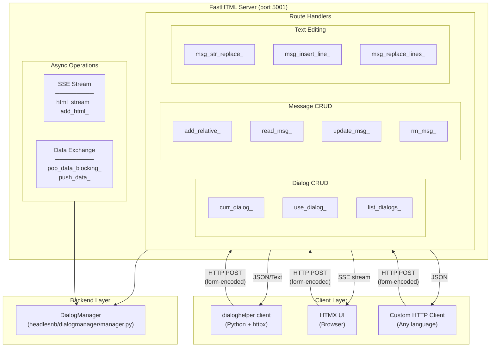

# DialogHelper Server Guide

This document explains the FastHTML-based HTTP server that provides backend compatibility with the [dialoghelper](https://github.com/AnswerDotAI/dialoghelper) Python client library.

## Table of Contents

- [Overview](#overview)
- [Why This Server?](#why-this-server)
- [Architecture](#architecture)
- [Getting Started](#getting-started)
- [API Reference](#api-reference)
- [Design Decisions](#design-decisions)
- [Testing](#testing)
- [Extending the Server](#extending-the-server)

---

## Overview

The DialogHelper server bridges the gap between HeadlesNB's DialogManager and web-based interfaces. It exposes DialogManager functionality via HTTP endpoints that are compatible with the dialoghelper Python client library.

### What It Does

- **HTTP API**: REST-like endpoints for dialog and message operations
- **SSE Streaming**: Real-time HTML updates via Server-Sent Events
- **Blocking Data Exchange**: Event-driven patterns with timeout support
- **Full CRUD**: Create, read, update, delete for dialogs and messages

### What It's For

| Use Case | Description |
|----------|-------------|
| Web UIs | Power HTMX-based interfaces for dialog editing |
| Remote Access | Control dialogs from other machines |
| dialoghelper Integration | Direct compatibility with existing dialoghelper code |
| Multi-client | Multiple clients can share dialog state |

---

## Why This Server?

### The Problem

DialogManager provides excellent Python API, but:
- Can't be accessed from web browsers
- Can't be accessed remotely
- Can't integrate with existing dialoghelper-based tools

### Our Solution

A lightweight HTTP server using FastHTML that:
- Implements all dialoghelper client endpoints
- Wraps DialogManager without duplicating logic
- Supports real-time updates via SSE

### Why FastHTML?

| Alternative | Why Not? |
|-------------|----------|
| Flask | Heavier, no built-in HTMX support |
| FastAPI | More complex, overkill for this use case |
| Raw Starlette | No convenience wrappers |
| **FastHTML** | Lightweight, Python-native, great HTMX/SSE support |

---

## Architecture



### Key Components

1. **Global Manager**: Single DialogManager instance serves all requests
2. **Route Handlers**: Async functions decorated with `@rt` handle HTTP requests
3. **Queue System**: `html_queues` and `data_store` for async data exchange
4. **Form Parsing**: All endpoints expect form-encoded POST data (not JSON)

---

## Getting Started

### Installation

```bash
# The server is included in headlesnb
pip install -e ".[dev]"
```

### Starting the Server

```python
# Option 1: Module execution
python -m headlesnb.dialoghelper_server

# Option 2: Example script with CLI options
python examples/dialoghelper_server_example.py --port 5001

# Option 3: Programmatic
from headlesnb.dialoghelper_server import init_manager, serve

manager = init_manager(root_path="./dialogs")
manager.use_dialog("demo", "demo.ipynb", mode="create")
serve(port=5001)
```

### Using with dialoghelper Client

```python
# Required setup variables (dialoghelper uses these for context)
__dialog_name = 'demo'
__msg_id = '_startup00'

from dialoghelper.core import curr_dialog, add_msg, read_msg

# These functions send HTTP requests to localhost:5001
info = curr_dialog()  # {'name': 'demo', 'mode': 'default'}

new_id = add_msg("Hello world", msg_type='note', placement='at_end')

result = read_msg(n=0, relative=False, nums=True)
print(result['msg']['content'])
```

---

## API Reference

### Dialog Operations

#### `POST /curr_dialog_`

Get information about the current dialog.

**Request Body:**
- `dlg_name` (str): Dialog name (optional, uses active dialog if empty)
- `with_messages` (str): "true" to include messages in response

**Response:**
```json
{"name": "demo", "mode": "default"}
// or with_messages=true:
{"name": "demo", "mode": "default", "messages": [...]}
```

**Why**: Clients need to know dialog state before operations. Returns minimal data by default for efficiency.

---

#### `POST /use_dialog_`

Create or connect to a dialog.

**Request Body:**
- `dlg_name` (str): Unique identifier
- `dialog_path` (str): Path to .ipynb file
- `mode` (str): "create" or "connect"

**Response:**
```json
{"status": "ok", "message": "Dialog 'demo' activated..."}
```

**Why**: Matches DialogManager.use_dialog() for creating new or loading existing dialogs.

---

### Message Operations

#### `POST /add_relative_`

Add a message relative to another message.

**Request Body:**
- `dlg_name` (str): Dialog name
- `content` (str): Message content
- `placement` (str): "at_start", "at_end", "add_after", "add_before"
- `msgid` (str): Reference message ID (for add_after/add_before)
- `msg_type` (str): "code", "note", "prompt", "raw"
- `output` (str): Initial output (optional)
- `pinned` (int): 1 to pin message
- `skipped` (int): 1 to skip message
- `run` (str): "true" to execute immediately

**Response:** Plain text message ID (e.g., `_a1b2c3d4`)

**Why**: Dialoghelper needs flexible placement. "add_relative" captures all insertion patterns in one endpoint.

---

#### `POST /read_msg_`

Read a message's content.

**Request Body:**
- `dlg_name` (str): Dialog name
- `n` (int): Index offset
- `relative` (str): "true" for relative to msgid, "false" for absolute
- `msgid` (str): Reference message ID
- `view_range` (str): JSON array `[start, end]` for line range
- `nums` (str): "true" to include line numbers

**Response:**
```json
{
  "msg": {
    "id": "_a1b2c3d4",
    "content": "     1 │ line1\n     2 │ line2",
    "msg_type": "code",
    ...
  }
}
```

**Why**: Flexible indexing (absolute or relative) supports different navigation patterns. Line numbers help with editing.

---

#### `POST /update_msg_`

Update message content or metadata.

**Request Body:**
- `dlg_name` (str): Dialog name
- `msgid` (str): Message ID to update
- `content` (str): New content (optional)
- `output` (str): New output (optional)
- `pinned`, `skipped`, `i_collapsed`, etc. (int): Metadata fields

**Response:** Plain text message ID

**Why**: Single endpoint for all updates. Only changed fields need to be sent.

---

#### `POST /rm_msg_`

Delete a message.

**Request Body:**
- `dlg_name` (str): Dialog name
- `msid` (str): Message ID to delete (note: `msid` not `msgid` for compatibility)

**Response:** "ok"

**Why**: The typo `msid` is maintained for dialoghelper client compatibility.

---

### Text Editing

#### `POST /msg_str_replace_`

Replace first occurrence of a string.

**Request Body:**
- `dlg_name`, `msgid`, `old_str`, `new_str`

**Response:**
```json
{"success": "Replaced text in message _a1b2c3d4"}
```

**Why**: Common editing operation. First occurrence only to avoid unintended changes.

---

#### `POST /msg_insert_line_`

Insert a line at a specific position.

**Request Body:**
- `dlg_name`, `msgid`, `insert_line` (int, 0-based), `new_str`

**Response:**
```json
{"success": "Inserted text after line 1 in message _a1b2c3d4"}
```

**Why**: Line-based editing is common in code. Zero-based indexing matches Python conventions.

---

#### `POST /msg_replace_lines_`

Replace a range of lines.

**Request Body:**
- `dlg_name`, `msgid`, `start_line` (int, 1-based), `end_line` (int, 1-based), `new_content`

**Response:**
```json
{"success": "Replaced lines 2 to 3 in message _a1b2c3d4"}
```

**Why**: Line-based editing with inclusive range. 1-based indexing matches `read_msg_` output with `nums=true`.

---

### Real-time Updates

#### `POST /add_html_`

Queue HTML for SSE delivery (HTMX OOB swaps).

**Request Body:**
- `dlg_name` (str): Dialog name (used as queue key)
- `content` (str): HTML content

**Response:** "ok"

**Why**: HTMX out-of-band swaps need server-pushed HTML. Queue allows async delivery.

---

#### `GET /html_stream_`

SSE endpoint for HTML updates.

**Query Params:**
- `dlg_name` (str): Dialog name

**Response:** Server-Sent Events stream

**Why**: Real-time UI updates without polling. SSE is simpler than WebSocket for one-way data.

---

#### `POST /pop_data_blocking_`

Wait for data with timeout.

**Request Body:**
- `data_id` (str): Unique identifier
- `timeout` (int): Seconds to wait

**Response:** JSON data or `{"error": "timeout"}`

**Why**: Enables request-response patterns across HTTP requests (e.g., wait for user input).

---

#### `POST /push_data_`

Push data for `pop_data_blocking_` to receive.

**Request Body:**
- `data_id` (str): Unique identifier
- `data` (str): JSON string

**Response:** "ok"

**Why**: Completes the blocking data exchange pattern.

---

## Design Decisions

### Decision 1: Form-Encoded POST (Not REST + JSON)

**Chosen**: All endpoints use form-encoded POST data.

**Why**: Dialoghelper client uses `httpx.post(data={...})` which sends form data. Maintaining compatibility is more important than REST purity.

**Trade-off**: Non-RESTful API, but full compatibility.

### Decision 2: Global Manager Instance

**Chosen**: Single `manager` global variable shared by all requests.

**Why**:
- Dialogs are shared state - multiple clients should see same data
- Simpler than dependency injection
- Matches dialoghelper's expectations

**Trade-off**: Can't run multiple isolated servers in same process.

### Decision 3: Active Dialog Switching

**Chosen**: Temporarily switch `active_dialog` for each request, then restore.

```python
prev_active = mgr.active_dialog
mgr.active_dialog = data['dlg_name']
try:
    # ... operation
finally:
    mgr.active_dialog = prev_active
```

**Why**: DialogManager operations use `active_dialog`. Each request might target different dialog.

**Trade-off**: Thread-safety concerns. Currently acceptable because:
- Python GIL limits true parallelism
- Operations are fast
- Could add per-request locking if needed

### Decision 4: Async for SSE Only

**Chosen**: Regular endpoints are sync, SSE is async.

**Why**:
- Most operations complete quickly - async overhead not worth it
- SSE needs async for efficient streaming
- FastHTML handles both well

---

## Testing

### Unit Tests

```bash
# Run server tests
pytest tests/test_dialoghelper_server.py -v

# Run integration tests (client compatibility)
pytest tests/test_integration_dialoghelper.py -v
```

### Test Categories

| Test File | Coverage |
|-----------|----------|
| `test_dialoghelper_server.py` | All endpoints, error handling |
| `test_integration_dialoghelper.py` | Response format compatibility |

### Manual Testing

```python
# Start server
python examples/dialoghelper_server_example.py

# In another terminal
curl -X POST http://localhost:5001/curr_dialog_ -d "dlg_name=demo"
```

---

## Extending the Server

### Adding New Endpoints

1. Add route handler in `dialoghelper_server.py`:

```python
@rt
async def my_new_endpoint_(req):
    """Description of endpoint.

    POST /my_new_endpoint_
    Body: param1, param2
    Returns: result
    """
    data = dict(await req.form())
    # ... implementation
    return JSONResponse({"result": "..."})
```

2. Add tests in `test_dialoghelper_server.py`
3. Document in this file

### Customizing the Manager

```python
from headlesnb.dialoghelper_server import init_manager, serve
from headlesnb.dialogmanager.llm import ClaudetteLLMClient  # Your LLM

manager = init_manager(
    root_path="./dialogs",
    llm_client=ClaudetteLLMClient(api_key="...")
)

serve(port=5001)
```

### Running Behind Proxy

```python
# For production, use uvicorn directly
import uvicorn
from headlesnb.dialoghelper_server import app, init_manager

init_manager(root_path="/data/dialogs")
uvicorn.run(app, host="0.0.0.0", port=5001, workers=1)
# Note: workers=1 because of global manager state
```

---

## See Also

- [Architecture Guide](ARCHITECTURE.md) - Overall system design
- [DialogManager Guide](DIALOGMANAGER.md) - DialogManager deep dive
- [dialoghelper docs](https://answerdotai.github.io/dialoghelper/) - Client library
