# DialogManager Guide

DialogManager provides AI-assisted dialog conversations stored as Jupyter notebooks with extended metadata. This guide covers the architecture, concepts, and advanced usage patterns.

For overall system architecture and design philosophy, see [ARCHITECTURE.md](ARCHITECTURE.md).

## Table of Contents

- [Overview](#overview)
- [Why DialogManager?](#why-dialogmanager)
- [Architecture](#architecture)
- [Core Concepts](#core-concepts)
- [Message Types](#message-types)
- [LLM Integration](#llm-integration)
- [Context Building](#context-building)
- [Serialization](#serialization)
- [Undo/Redo System](#undoredo-system)
- [Design Decisions](#design-decisions)
- [Advanced Patterns](#advanced-patterns)
- [Testing](#testing)

---

## Overview

DialogManager extends the concept of Jupyter notebooks to support AI-assisted dialogs. Instead of cells, dialogs contain **messages** with rich metadata for LLM interactions.

Key features:
- Message-based conversation management
- LLM integration with context building
- Bidirectional serialization (Dialog <-> Notebook)
- Full undo/redo support
- Pinned/skipped message control

---

## Why DialogManager?

### The Problem

NotebookManager is great for notebooks, but AI dialogs have different needs:

| Notebook Need | Dialog Need |
|---------------|-------------|
| Cells with code/markdown | Messages with types (code, note, prompt, raw) |
| Sequential execution | LLM prompt → response flow |
| Cell outputs | Message outputs + LLM responses |
| No context management | Token-limited context windows |
| Index-based references | Stable ID references (for pinned/skipped) |

### Our Solution

A separate manager that:
- **Shares infrastructure** with NotebookManager (base classes, execnb, history)
- **Has dialog-specific semantics** (message types, LLM integration, context building)
- **Stores as .ipynb** for Jupyter compatibility

### Why Not Extend NotebookManager?

Considered but rejected:
1. **Different abstractions**: "Cell" vs "Message" have different semantics
2. **Different operations**: `execute_prompt()` vs `execute_cell()`
3. **Different metadata**: LLM context flags (pinned/skipped) don't make sense for notebooks

Trade-off: Some code duplication, but cleaner separation of concerns.

---

## Architecture

```mermaid
flowchart TB
    subgraph DM["DialogManager"]
        direction TB

        subgraph Core["Core Components"]
            direction LR
            Dialogs["Dialogs<br/>─────────<br/>• DialogInfo<br/>• Path<br/>• Shell<br/>• Messages list"]
            Messages["Messages<br/>─────────<br/>• Content<br/>• Type (code/note/prompt/raw)<br/>• Output<br/>• Metadata (pinned, skipped)"]
            LLMInt["LLM Integration<br/>─────────<br/>• LLMClient interface<br/>• MockLLMClient<br/>• ContextBuilder<br/>• Token budgets"]
        end

        subgraph Serialization["Serialization Layer"]
            direction LR
            D2N["dialog_to_notebook()"]
            N2D["notebook_to_dialog()"]
            Sep["Prompt Separator Pattern<br/>(stores prompt + response)"]
        end

        subgraph Execution["Execution Engine"]
            CS["execnb CaptureShell<br/>─────────<br/>• IPython wrapper<br/>• Code execution<br/>• Output capture"]
        end
    end

    Dialogs --> D2N
    Messages --> D2N
    D2N --> IPYNB[(".ipynb files")]
    IPYNB --> N2D
    N2D --> Messages

    LLMInt --> Dialogs
    Messages --> LLMInt

    Dialogs --> CS
    CS --> Messages
```



### Components

1. **DialogManager**: Main coordinator class
2. **DialogInfo**: Stores dialog state and metadata
3. **Message**: Individual message dataclass
4. **Serialization**: Dialog <-> Notebook conversion
5. **LLM Client**: Abstract interface for LLM calls
6. **ContextBuilder**: Smart context window management

---

## Core Concepts

### Dialogs

A dialog is a conversation stored as a Jupyter notebook. Each dialog has:
- A unique name (identifier)
- A file path (.ipynb)
- A kernel (CaptureShell) for code execution
- A list of messages
- An optional LLM client

```python
from headlesnb import DialogManager
from headlesnb.dialogmanager.llm import MockLLMClient

manager = DialogManager(
    root_path=".",
    default_llm_client=MockLLMClient(responses=["Hello!"])
)

# Create a new dialog
manager.use_dialog("chat", "chat.ipynb", mode="create")

# Connect to existing dialog
manager.use_dialog("existing", "existing.ipynb", mode="connect")
```

### Messages

Messages are the building blocks of dialogs. Each message has:

```python
from headlesnb.dialogmanager import Message

message = Message(
    content="import pandas as pd",
    msg_type="code",        # 'code', 'note', 'prompt', 'raw'
    output="",              # Execution output or LLM response
    pinned=0,               # 1 = always include in LLM context
    skipped=0,              # 1 = exclude from LLM context
    time_run=None,          # Timestamp of last execution
    is_exported=0,          # Export flag
    i_collapsed=0,          # Input collapsed state
    o_collapsed=0,          # Output collapsed state
    heading_collapsed=0,    # Heading collapsed state
    use_thinking=False      # Enable thinking mode for LLM
)
```

---

## Message Types

### Code Messages

Executable Python code. When included in LLM context, code is wrapped in code blocks with outputs.

```python
manager.add_message("import pandas as pd\ndf = pd.read_csv('data.csv')", msg_type='code')

# Execute the code
outputs = manager.execute_code(code="print(df.head())")
```

In LLM context:
```
```python
import pandas as pd
df = pd.read_csv('data.csv')
```

Output:
```
   col1  col2
0     1     4
1     2     5
```
```

### Note Messages

Markdown documentation and context. Useful for providing background information.

```python
manager.add_message("""
# Data Analysis Project

This notebook analyzes sales data from Q4 2024.
Key metrics:
- Revenue by region
- Customer acquisition cost
- Churn rate
""", msg_type='note')
```

In LLM context:
```
[Note]
# Data Analysis Project

This notebook analyzes sales data from Q4 2024.
...
```

### Prompt Messages

Questions for the LLM. The content is sent as a user message, and the response is stored as output.

```python
manager.add_message("Explain what the code above does", msg_type='prompt')
response = manager.execute_prompt()
print(response.content)  # LLM's explanation
```

### Raw Messages

Unprocessed content. Included as-is in the LLM context.

```python
manager.add_message("Some raw content", msg_type='raw')
```

---

## LLM Integration

### LLMClient Interface

Implement this interface to integrate your LLM:

```python
from headlesnb.dialogmanager.llm import LLMClient, LLMResponse
from typing import List, Dict, Any

class MyLLMClient(LLMClient):
    def chat(
        self,
        messages: List[Dict[str, Any]],
        system_prompt: str = "",
        **kwargs
    ) -> LLMResponse:
        # Call your LLM API
        response = my_api.chat(messages, system=system_prompt)

        return LLMResponse(
            content=response.text,
            tool_calls=response.tool_calls,
            usage={"input_tokens": 100, "output_tokens": 50},
            model="my-model",
            stop_reason="end_turn"
        )

    def count_tokens(self, text: str) -> int:
        # Use your tokenizer
        return len(my_tokenizer.encode(text))
```

### LLMResponse

Standard response format:

```python
from dataclasses import dataclass
from typing import List, Dict, Any, Optional

@dataclass
class LLMResponse:
    content: str                              # Response text
    tool_calls: Optional[List[Dict]] = None   # Tool/function calls
    usage: Optional[Dict[str, int]] = None    # Token usage
    model: Optional[str] = None               # Model used
    stop_reason: Optional[str] = None         # Why stopped
```

### MockLLMClient

For testing without API calls:

```python
from headlesnb.dialogmanager.llm import MockLLMClient, MockLLMResponse

# Simple responses
client = MockLLMClient(responses=[
    "First response",
    "Second response"
])

# With tool calls
client = MockLLMClient(responses=[
    MockLLMResponse(
        content="I'll search for that",
        tool_calls=[{
            "name": "search",
            "input": {"query": "test"}
        }]
    ),
    "Found 5 results"
])

# Helper for tool use testing
from headlesnb.dialogmanager.llm import create_mock_for_tool_use

client = create_mock_for_tool_use(
    tool_name="calculator",
    tool_input={"expression": "2+2"},
    final_response="The result is 4"
)
```

---

## Context Building

ContextBuilder creates LLM context from dialog messages with token budget management.

### Basic Usage

```python
from headlesnb.dialogmanager.llm import ContextBuilder

builder = ContextBuilder(
    llm_client=my_client,  # For token counting
    max_tokens=200000      # Context window size
)

messages = builder.build_context(
    dialog_messages=dialog.messages,
    current_prompt="What does this code do?",
    include_outputs=True,
    system_prompt="You are a helpful assistant.",
    reserved_tokens=4096  # For response
)
```

### Message Filtering

**Pinned Messages**: Always included, regardless of token budget.

```python
# Pin important context
manager.add_message("API_KEY = 'xxx'", msg_type='code', pinned=1)
```

**Skipped Messages**: Never included.

```python
# Skip old, irrelevant content
manager.update_message(msg_id, skipped=1)
```

### Token Budget Strategy

1. Reserve tokens for response
2. Account for system prompt
3. Always include pinned messages
4. Skip messages marked as skipped
5. Include recent messages newest-first until budget exhausted
6. Maintain chronological order in final output

---

## Serialization

Dialogs are stored as Jupyter notebooks with extended cell metadata.

### Dialog to Notebook

```python
from headlesnb.dialogmanager import dialog_to_notebook

notebook = dialog_to_notebook(dialog_info)
# Returns nbformat.NotebookNode
```

### Notebook to Dialog

```python
from headlesnb.dialogmanager import notebook_to_dialog

messages = notebook_to_dialog(notebook)
# Returns List[Message]
```

### Cell Format

Each message becomes a cell with metadata:

```json
{
  "cell_type": "code",
  "metadata": {
    "solveit": {
      "msg_type": "code",
      "msg_id": "abc123",
      "pinned": 0,
      "skipped": 0,
      "time_run": "2024-01-15T10:30:00"
    }
  },
  "source": ["import pandas as pd"],
  "outputs": []
}
```

### Prompt Separator Pattern

Prompt messages use a special separator to store both content and LLM response:

```markdown
What does this code do?

##### 🤖Reply🤖<!-- SOLVEIT_SEPARATOR_abc123def456 -->

The code imports pandas and creates a DataFrame...
```

---

## Undo/Redo System

DialogManager uses the Command Pattern for full undo/redo support.

### Supported Operations

- `InsertMessageCommand` - Adding messages
- `DeleteMessageCommand` - Removing messages
- `UpdateMessageCommand` - Modifying message content/attributes
- `MoveMessageCommand` - Repositioning messages
- `SwapMessagesCommand` - Swapping two messages
- `UpdateMessageOutputCommand` - Updating outputs (for prompt execution)

### Usage

```python
# Perform operations
msg1 = manager.add_message("First", msg_type='note')
msg2 = manager.add_message("Second", msg_type='note')
manager.swap_messages(msg1, msg2)

# Undo
manager.undo()  # Undo swap
manager.undo(steps=2)  # Undo both adds

# Redo
manager.redo()  # Redo first add
manager.redo(steps=2)  # Redo add and swap

# View history
history = manager.get_history()
print(history['undo_stack'])  # Operations available to undo
print(history['redo_stack'])  # Operations available to redo

# Clear history
manager.clear_history()
```

### What's NOT Tracked

- `execute_code` - Code execution doesn't modify dialog structure
- `execute_prompt` output - Stored separately, can be re-run
- Read operations - Non-destructive queries

---

## Advanced Patterns

### Pattern 1: Iterative Analysis

Build analysis incrementally with LLM assistance:

```python
manager.use_dialog("analysis", "analysis.ipynb", mode="create")

# Set up context
manager.add_message("# Sales Analysis\nQ4 2024 data exploration", msg_type='note', pinned=1)
manager.add_message("import pandas as pd\ndf = pd.read_csv('sales.csv')", msg_type='code')
manager.execute_code(code="import pandas as pd\ndf = pd.read_csv('sales.csv')")

# First question
manager.add_message("What patterns do you see in this data?", msg_type='prompt')
response1 = manager.execute_prompt()

# Follow-up based on response
manager.add_message("Show me code to visualize the trend you mentioned", msg_type='prompt')
response2 = manager.execute_prompt()
```

### Pattern 2: Code Review Dialog

```python
manager.use_dialog("review", "review.ipynb", mode="create")

# Add code to review
manager.add_message('''
def calculate_metrics(data):
    results = []
    for item in data:
        if item['value'] > 0:
            results.append(item['value'] * 1.1)
    return results
''', msg_type='code')

# Request review
manager.add_message("Review this code for performance and suggest improvements", msg_type='prompt')
response = manager.execute_prompt(
    system_prompt="You are an expert Python code reviewer."
)
```

### Pattern 3: Multi-Step Problem Solving

```python
manager.use_dialog("problem", "problem.ipynb", mode="create")

# Define the problem
manager.add_message("""
# Problem: Optimize Database Queries

Current issue:
- API response time: 2.5s average
- Database queries: 15 per request
- N+1 query pattern detected
""", msg_type='note', pinned=1)

# Step 1: Analysis
manager.add_message("Analyze the root causes of this performance issue", msg_type='prompt')
analysis = manager.execute_prompt()

# Step 2: Solution
manager.add_message("Propose a solution with code examples", msg_type='prompt')
solution = manager.execute_prompt()

# Step 3: Implementation
manager.add_message("Write the implementation code", msg_type='prompt')
implementation = manager.execute_prompt()
```

### Pattern 4: Context-Aware Debugging

```python
manager.use_dialog("debug", "debug.ipynb", mode="create")

# Pin the error context
manager.add_message("""
Error traceback:
```
TypeError: 'NoneType' object is not subscriptable
  File "app.py", line 45, in process_data
    result = data['key']['nested']
```
""", msg_type='note', pinned=1)

# Add relevant code
manager.add_message('''
def process_data(data):
    result = data['key']['nested']
    return result
''', msg_type='code')

# Debug
manager.add_message("What's causing this error and how do I fix it?", msg_type='prompt')
response = manager.execute_prompt()
```

### Pattern 5: Tool Use with Mock

```python
from headlesnb.dialogmanager.llm import create_mock_for_tool_use

# Simulate tool-using LLM
client = create_mock_for_tool_use(
    tool_name="search_codebase",
    tool_input={"query": "authentication"},
    final_response="Found 3 relevant files: auth.py, login.py, session.py"
)

manager = DialogManager(default_llm_client=client)
manager.use_dialog("search", "search.ipynb", mode="create")

manager.add_message("Find all authentication-related code", msg_type='prompt')
response = manager.execute_prompt()

# First response has tool call
if response.tool_calls:
    tool_call = response.tool_calls[0]
    # Handle tool execution...

    # Continue conversation
    manager.add_message("Now summarize what you found", msg_type='prompt')
    final_response = manager.execute_prompt()
```

---

## Testing

### Testing with MockLLMClient

```python
import pytest
from headlesnb import DialogManager
from headlesnb.dialogmanager.llm import MockLLMClient

def test_dialog_flow():
    client = MockLLMClient(responses=[
        "I understand you want to analyze data.",
        "Here's the analysis: ..."
    ])

    manager = DialogManager(default_llm_client=client)
    manager.use_dialog("test", "test.ipynb", mode="create")

    manager.add_message("Analyze this data", msg_type='prompt')
    response1 = manager.execute_prompt()
    assert "analyze" in response1.content.lower()

    manager.add_message("Continue", msg_type='prompt')
    response2 = manager.execute_prompt()
    assert "analysis" in response2.content.lower()
```

### Testing Undo/Redo

```python
def test_undo_redo():
    manager = DialogManager()
    manager.use_dialog("test", "test.ipynb", mode="create")

    # Add messages
    msg1 = manager.add_message("First", msg_type='note')
    msg2 = manager.add_message("Second", msg_type='note')

    assert len(manager.list_messages()) == 2

    # Undo
    manager.undo()
    assert len(manager.list_messages()) == 1

    # Redo
    manager.redo()
    assert len(manager.list_messages()) == 2
```

### Testing Serialization

```python
from headlesnb.dialogmanager import (
    dialog_to_notebook,
    notebook_to_dialog,
    Message
)

def test_roundtrip():
    messages = [
        Message(content="import pandas", msg_type='code'),
        Message(content="What's next?", msg_type='prompt', output="Try this...")
    ]

    # Create dialog info
    dialog = DialogInfo(name="test", messages=messages)

    # Convert to notebook
    notebook = dialog_to_notebook(dialog)

    # Convert back
    recovered = notebook_to_dialog(notebook)

    assert len(recovered) == 2
    assert recovered[0].msg_type == 'code'
    assert recovered[1].msg_type == 'prompt'
    assert recovered[1].output == "Try this..."
```

---

## Design Decisions

This section explains key design choices. For overall architecture, see [ARCHITECTURE.md](ARCHITECTURE.md).

### Decision 1: Message IDs Instead of Indices

**Chosen**: Messages have stable string IDs (e.g., `_a1b2c3d4`)

**Why**:
- LLM responses reference messages; indices shift when messages are inserted/deleted
- Pinned/skipped status needs stable references
- Context builder needs to track which messages are included

**Trade-off**: Slightly more complex lookups (`get_message_by_id()` vs array access)

### Decision 2: Prompt/Response in Single Message

**Chosen**: Prompt message stores both content and output (LLM response)

**Why**:
- Keeps prompt and response together
- Enables re-running prompts
- Matches notebook cell model (input + output)

**Alternative**: Separate prompt and response messages. Rejected because it complicates context building.

### Decision 3: Abstract LLMClient

**Chosen**: `LLMClient` is an abstract base class with `MockLLMClient` for testing

**Why**:
- No vendor lock-in (Claude, OpenAI, local models all work)
- Testing without API calls or costs
- Clear interface for new implementations

**Trade-off**: Users must implement or choose an LLMClient

### Decision 4: Context Building Strategy

**Chosen**: Newest messages first, respect pinned/skipped, stay within token budget

**Why**:
- Recent context usually more relevant
- Pinned messages guarantee important context
- Token limits are real constraints

**Alternative**: Oldest first, summarization, etc. Could be added as options.

### Decision 5: Separator Pattern for Serialization

**Chosen**: Prompt cells use special separator to store response inline

```markdown
What is Python?

##### 🤖Reply🤖<!-- SOLVEIT_SEPARATOR_abc123 -->

Python is a programming language...
```

**Why**:
- Single cell for prompt+response (cleaner notebook structure)
- Human-readable when opened in Jupyter
- Unique separator prevents collision with content

**Trade-off**: Parsing complexity, but encapsulated in serialization module

---

## Best Practices

1. **Pin Important Context**: Use `pinned=1` for information that should always be in LLM context.

2. **Skip Stale Content**: Mark old, irrelevant messages as `skipped=1` to save context space.

3. **Use Note Messages for Structure**: Add note messages as section headers and context.

4. **Test with MockLLMClient**: Develop and test without API calls.

5. **Monitor Token Usage**: Use `count_tokens()` and `ContextBuilder` to stay within limits.

6. **Leverage Undo/Redo**: Don't be afraid to experiment - you can always undo.

7. **Serialize Regularly**: Call `unuse_dialog()` to save to disk.

---

## See Also

- [Architecture Guide](ARCHITECTURE.md) - System design and rationale
- [API Reference](API.md) - Complete API documentation
- [Quick Start](../QUICKSTART.md) - Getting started guide
